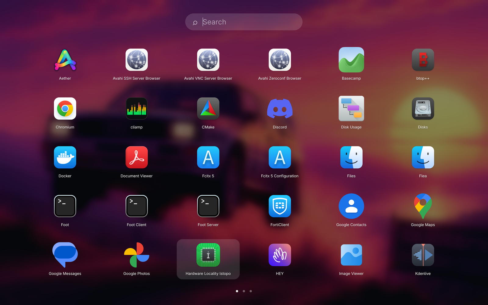

# Launchpad

> **Archived record — no longer maintained here.** Development moved on
> 2026-09-24 to a private repository of ours; this copy stays as the record of
> the work up to that point (see `docs/FINDINGS.md` for the paging and geometry
> lessons). Upstream remains
> [`AndyWeiBoan/omarchy-launchpad`](https://github.com/AndyWeiBoan/omarchy-launchpad).

A macOS-style application grid for [Omarchy](https://omarchy.org), as a shell
plugin.

> **This is a fork.** Upstream is
> [`AndyWeiBoan/omarchy-launchpad`](https://github.com/AndyWeiBoan/omarchy-launchpad)
> (MIT, and still this plugin's owner: the grid, the icons, the entrance, the
> hand-tracked close and the uninstall delegation are all theirs), kept here as
> the `upstream` remote. Two things changed in this fork, both from the same
> brief — *match macOS's own Launchpad more closely, and page it the way the
> three-finger workspace swipe moves*:
>
> - **the page is 7 × 5 instead of 6 × 5**, and the margins and bands around it
>   were tightened so the icons are larger and closer together;
> - **paging runs on the kit's motion engine** instead of an accumulator: the
>   page follows the fingers and the release is decided by where the motion
>   would have come to rest.
>
> The plugin id stays `io.github.andyweiboan.launchpad` on purpose, so an
> existing install (and the config blocks that name it) keep working. Install
> this fork with the URL below; `omarchy plugin update <id>` then follows this
> repository.



A full-screen page of app icons over your own wallpaper, blurred and dimmed,
with a search pill at the top and page dots at the bottom. Type to filter, swipe
or scroll to page, click to launch — or drive the whole thing from the keyboard
without ever touching the pointer.

It arrives the way macOS does it: the page contracts into place from slightly
larger than the screen while the wallpaper behind it goes out of focus, and
leaves by reversing that. Spreading four fingers apart closes it, and does so
under the hand — the grid follows the fingers rather than waiting for a
threshold.

The page is a fixed **7 × 5** shape and every other dimension — cell, icon,
label, padding — is derived from it and from the screen it is on. That is what
makes it read as Launchpad rather than as a generic app menu, and it is why
there is one window per screen: a 5K monitor and a laptop panel each size their
own grid instead of sharing one pixel-fixed icon size.

Seven columns, and the horizontal proportions, are macOS's own — measured off
Apple's Launchpad help screenshots rather than guessed (the annotation border
cropped off, what is left is a full 16:10 screen: 931 × 580, seven column centres
116.3px apart on a 931px-wide screen). That is **12.5% of the screen per column**
and, with the block of seven centred, **8.7% of the screen outside the outermost
icons**. What the plugin did before was spread seven columns across the whole
usable width — 88.7% of the screen with 5.6% margins — which is what "the two
sides are wrong" was: the same icons laid out wider than the thing they copy,
with the margins eaten. The rows stay this machine's own (macOS stops its page at
79.7% of the height because its Dock occupies the bottom fifth; the Dock here is
*behind* the grid, so that band would be empty space).

## Install

```bash
omarchy plugin add https://github.com/alijiujiu123/omarchy-launchpad --enable
```

Then bind a key — plugins cannot bind keys themselves. In
`~/.config/hypr/bindings.lua`:

```lua
o.bind("SUPER + A", "Launchpad (app grid)",
  "omarchy-shell shell toggle io.github.andyweiboan.launchpad '{}'")
```

For the legacy (non-Lua) Hyprland config format, see
[`install/bindings.conf`](install/bindings.conf).

Touchpad gestures are optional and live in
[`install/gestures.lua`](install/gestures.lua): four fingers together to open,
which is the gesture macOS uses. Closing is not in that file — the plugin reads
the spread itself, and a compositor gesture for it would fire at a threshold and
cut the hand-tracked close short. See [Gestures](#gestures).

`SUPER+A` rather than `SUPER+SPACE` because Omarchy's own launcher already owns
that, and the two answer different questions — the launcher is for *I know what
I want*, Launchpad is for *show me everything*.

## Removal

```bash
omarchy plugin disable io.github.andyweiboan.launchpad
omarchy plugin remove  io.github.andyweiboan.launchpad
```

Then delete the bind you added to `bindings.lua`, and the gesture from
`input.lua` if you added that.

The plugin keeps no configuration and no state. The one thing it writes is a
small backdrop image under `$XDG_RUNTIME_DIR/omarchy-launchpad/`, which is
tmpfs — it is gone at logout whether you remove the plugin or not, and nothing
of yours lives there. Nothing is written under `~`, there are no autostart
entries, and disabling the plugin is enough to stop it being mounted. The
keybinding is the only thing it asks you to change, and you make that change
yourself.

## Keys

| Key | Action |
| --- | --- |
| *(type anything)* | Filter by name or generic name, live |
| `←` `→` `↑` `↓` | Move the selection — but only when the search box is empty, so arrow keys still edit the text |
| `Enter` | Launch the selected app |
| `Shift` + `←` `→` | Previous / next page — again only with the search box empty, so `Shift`+arrow still selects text |
| `Tab` / `Shift`+`Tab` | Previous / next page, whether or not you are searching |
| `PageUp` / `PageDown` | Same, for keyboards that have those keys |
| **Hold an icon** (or right-click it) | Enter jiggle mode — every icon gets a remove badge |
| **Click a remove badge** | Uninstall that app, after a confirmation |
| Click an icon while jiggling | Leave jiggle mode (it does **not** launch) |
| `Esc`, click the backdrop | Back out one layer: dialog, then jiggle mode, then Launchpad |
| **Four fingers apart** | Close, tracking the fingers — see [Gestures](#gestures) |

It opens on the display you are working on, not on all of them at once, and it
opens on page one however you left it.

Scroll or drag sideways to page; click a page dot to jump. Both a two-finger
touchpad scroll (either axis) and a pointer drag **move the page under your
hand** — 1:1, not in jumps — and letting go decides where it lands:

- the travel is projected to where it *would* have come to rest (constant
  deceleration, `v²/2a`, on a recency-weighted velocity of the last few tens of
  milliseconds);
- it commits if that projection crossed **half a page**, or if a single event
  moved faster than **150 units** (the flick rule);
- nothing counts below **a tenth of a page**, so a twitch is not a decision;
- whatever does not commit springs back, and whatever does settles on the same
  curve and duration the three-finger workspace swipe uses.

**The release comes from the protocol, not from a gap in the stream.** A
trackpad's axis events carry a phase, and Qt passes it through (`Qt.ScrollBegin`
/ `ScrollUpdate` / `ScrollEnd` / `ScrollMomentum`, from `wl_pointer`'s
`axis_source` and `axis_stop` — which is libinput telling the compositor, and the
compositor telling the client, that the fingers have left). So a gesture has a
real beginning and a real end: the page follows from the first event to the last
and decides exactly once, at the end. That is the same information the
three-finger workspace swipe gets from the compositor, and the difference is
visible — with the release guessed from a 90ms quiet gap instead, one swipe was
cut into two or three "gestures", each one deciding and settling, and the page
spent the swipe being animated back rather than following.

There is exactly **one writer** on the page's position at any moment: the follow
while the fingers are down, the settle after they leave. A running
`NumberAnimation` owns its property — assignments to it are overwritten on the
next frame — so a settle still in flight when the next gesture starts would
swallow the whole follow; the gesture begins by *stopping* it and taking over
from the pixels on screen, which is the engine's own rule ("follow from wherever
the value currently is").

**The units are measured, not derived.** `angleDelta` is not the compositor's
delta — Qt reports a trackpad's continuous axis events about an order of
magnitude larger than Hyprland's — so the thresholds were placed after recording
real gestures (a temporary log in the wheel path, three reference gestures, and
a simulation of them):

| gesture | travel | per-event peak |
| --- | --- | --- |
| a light short touch | 61 units | 40 |
| a quick short swipe | 677 | 131 |
| a normal swipe, "one page" | 1974 | 58 |
| a deliberate flick | 1188–4653 | 244–535 |

That is where **2000 units per page**, a **0.5 page** half-over (1000 units), a
**150 unit** flick threshold and a **0.1 page** floor come from. Guessing them
the first time is what made paging turn a page on a touch: the value inherited
from the old accumulator was 120 units per page, which is 6% of a real swipe.

That is the kit's motion engine, not a paging heuristic: `MotionMath.js` is
imported from `~/.config/omarchy/motion/` (installed by the kit's `motion`
module) and the parameters above live in the plugin's `paging` record in the
engine's own vocabulary. A page turn and a workspace swipe travel the same
distance in the same time — 500 ms on `momentumSettle` — because it is the same
algebra.

Two consequences worth knowing:

- **One swipe is one page.** The page never runs further than one page ahead of
  where the fingers started, however hard the flick is; a second page needs a
  second gesture. The kinetic tail after the release arrives tagged
  `ScrollMomentum` and is ignored: it is coast, not fingers, and the settle owns
  the page from the release on.
- **A mouse wheel notch is a page turn, and not a gesture at all.** A detent is
  120 `angleDelta` on the nose and Qt gives wheel events no begin and no end, so
  a wheel takes the discrete route (one notch, one page, the same settle) rather
  than the follow — "how far has it moved" is not a question a notched device
  answers, and 120 is not comparable with the ~2000 a trackpad swipe
  accumulates. A pointer drag does take the follow, and has no flick rule: that
  threshold is a per-event quantity measured on the touchpad's event stream,
  which a pointer's events have no calibration for, so a drag commits on travel
  or projection — half a page of pointer travel.

### The selection and the page are one thing

There is a single highlight and `Enter` always launches whatever it is on. The
page follows it in both directions: walking the selection off the right-hand
edge turns the page, and turning the page by wheel, drag, dot or key moves the
selection onto the page you arrived at. Without the second half, paging away
would leave `Enter` pointing at an icon you can no longer see.

Pointer and keyboard take turns rather than fighting: hovering an icon hands the
selection to the pointer, pressing an arrow key takes it back. Hover is read on
the way *in* only, so a cursor resting in the gap between two icons is not a
request to deselect anything.

A page that is turning does not count as hovering. Qt re-delivers hover when
items move beneath a stationary cursor, so a turn sweeps thirty icons past the
pointer in 220 ms and each one announces itself — including the ones on the page
being left. Letting those through fed straight into the rule above and dragged
the view back where it came from: the page would start to move, spring back, and
paging felt like pushing against something. A pointer that has not moved is not
hovering; the content is.

### Why paging is not on `Ctrl` or `Super`

Hyprland dispatches its own keybinds before the focused client sees the key, and
holding exclusive keyboard focus does not change that — so any modifier the
compositor has claimed is simply unreachable in here. In a stock Omarchy config
that is `Super` + arrows (directional window focus), and in many setups `Ctrl` +
arrows as well. Plain `Shift` + arrows is the one arrow combination nothing
upstream tends to take. If your config does claim it, `Tab` always works.

`PageUp` / `PageDown` are bound for completeness rather than as the answer: an
Apple laptop keyboard has no such keys, only `Fn` + `↑` `↓`.

`Enter` deliberately does nothing while the confirmation is up. An alert that
uninstalls on the key you were already pressing to launch something is a trap,
so the answer has to be a deliberate click.

## Uninstalling

Hold an icon and the grid starts wobbling with a remove badge on every app,
exactly as macOS Launchpad does; right-click gets there too, because holding a
mouse button to edit is not a gesture anyone tries on a desktop. Click a badge
and Launchpad asks before doing anything.

It is a mode, not a menu: anything that is not a badge leaves it, including
clicking an icon — so the click that stops editing never also launches
something. Typing leaves it as well, since a search is a request to find
something rather than to keep editing.

The removal itself is entirely Omarchy's. Confirming calls the shell's own
`AppLibrary.remove()`, which runs `omarchy-remove-launcher-entry` — that decides
for itself whether the entry is a web app, a terminal wrapper, a hand-written
`.desktop` file, a system package or a Flatpak. Where elevated rights are
needed it opens a floating terminal, so the authentication prompt is visible to
you rather than happening somewhere you cannot see.

Note that the system-package branch removes unused dependencies along with the
application, so uninstalling one thing can remove several packages. That is
Omarchy's behaviour rather than this plugin's, and the terminal lists everything
before you confirm.

**This plugin contains no privilege escalation, no package-manager command, and
no shell string.** That is the difference between delegating a privileged action
and performing one, and it is deliberate. If the host does not provide an
`AppLibrary`, the badge does nothing rather than falling back to something
homemade.

Names taken from `.desktop` files are stripped of control characters before they
are displayed or handed on. `printf %q` protects a shell correctly, but escape
sequences survive it and reach the terminal emulator, which is a different
reader with different rules.

## Requirements

No external dependencies to install — everything it uses already ships with
Omarchy.

- Omarchy with shell plugin support (`omarchy plugin list` works)
- `uwsm-app` and `gtk-launch`, used to start the application you pick. Both come
  with Omarchy. Going through `uwsm-app` is what keeps launched apps out of the
  compositor's own systemd scope, which is the same path Omarchy's menu uses.
- ImageMagick 7, for the backdrop — part of Omarchy's base set, nothing to add.
  The helper calls `magick`; a system old enough to have only `convert` fails
  the render and falls back to the bundled backdrop rather than erroring.
- Qt 6.8 or newer. The grid relies on `Image.retainWhileLoading` to hold a
  frame across the reload that a hide/show cycle forces — see
  [Performance](#performance).

## The backdrop

The background is your own wallpaper, blurred. **This plugin never opens your
wallpaper**, and the distinction is the whole design.

A check that ends before a read cannot bind what the read consumes: the state
link, and whatever it points at, can be replaced in between. Validating the
pathname harder does not help, because a pathname is not what gets decoded.

So [`bin/backdrop`](bin/backdrop) does the decoding instead. It resolves the
link, refuses anything that is not a bounded regular file, and re-encodes a
1280×800 JPEG into `$XDG_RUNTIME_DIR` under explicit ImageMagick resource limits
and a timeout. The only pathname that reaches an image loader in the shell is
that output — a file this plugin wrote. A hostile wallpaper costs a short-lived
helper its timeout and leaves the previous backdrop on screen; it cannot reach
the process that owns your desktop.

**The helper hands over a sharp copy, and the blur happens here.** That is a
deliberate change from handing over a finished blurred pane, and the reason is
motion: a pre-blurred image is one fixed amount of blur, so the most it can do
is fade up, and a blur that fades up at full strength reads as the blur
*appearing* rather than as the screen going out of focus. Blurring in QML makes
the radius a number, and a number can be run from nothing to full over the
length of the opening and back down on the way out.

The cost of that choice is the render: about 395 ms for a wallpaper that has
changed, against roughly 60 ms for the old blur-a-thumbnail-and-scale-it-up
trick. It is paid almost never. An unchanged wallpaper is a `stat` and a string
compare — 3 ms, measured — and the helper answers `stale` *before* it starts
work, so the overlay opens immediately on the bundled backdrop and the new one
fades in behind it. A bundled backdrop ships with the plugin and shows whenever
the helper declines, so there is always something to look at.

Applications come from `DesktopEntries`, Quickshell's own XDG `.desktop` index,
so installs and removals are picked up live with no watcher and no cache of our
own. Entries marked `NoDisplay` are skipped.

## Motion

Two timings, because the blur and the grid are not the same material.

| | In | Out |
| --- | --- | --- |
| The grid — contract and fade | 320 ms | 240 ms |
| The wallpaper's blur and dim | 380 ms | 340 ms |

Three rules produce those numbers, and the sibling Mission Control overlay is
timed off the same three, so the two read as parts of one desktop rather than as
two programs that happen to share a screen:

- **Arriving takes longer than leaving.** Something coming towards you is worth
  watching; something going away has already said what it had to say.
- **The atmosphere outlives the content.** The blur starts before the icons and
  finishes after them, so the last thing on screen is a dissolve rather than a
  cut.
- **Translations accelerate away; fades taper.** A thing sliding off should look
  like it is leaving. A thing dissolving should not — an accelerating fade puts
  most of the alpha in the last few frames, which reads as a flash.

The entrance is started on the first frame the surface actually renders, not on
the frame it is told to appear. Mapping a layer surface, allocating the blur's
buffers and uploading the icon textures costs about 100 ms here, every time,
because the surface is torn down on every hide. Started at the earlier moment
the animation clock ran through all of that with nothing on screen, and the
first frame anyone saw was already a quarter of the way in.

## Gestures

Four fingers together opens it. That one has to go through the compositor:
before the overlay exists there is no surface for a gesture to be delivered to,
and a configured Hyprland gesture is a single action at a single threshold —
there is no progress to read.

Four fingers apart closes it, and that one is read here. Once the overlay is up
it is an ordinary Wayland client holding pointer focus, and Hyprland forwards
the pinch to it over `zwp_pointer_gestures_v1` — four fingers included, even
while its own gesture config is watching the same pinch. So the close can follow
the hand: the grid thins and spreads as the fingers part, and letting go past
the commit point carries that straight on into the close instead of restarting
it.

Two details that are easy to get wrong:

- **`PinchArea`, not `PinchHandler`.** A touchpad pinch arrives as a Wayland
  native gesture, which has no touch points; the newer pointer handlers want
  touch points and never fire. Measured side by side in the same window on the
  same gestures: 370 events on `PinchArea`, 0 on `PinchHandler`.
- **The direction names in Hyprland's gesture config are inverted** relative to
  what the hand does. `pinchin` fires when the fingers move *apart* — the names
  follow the zoom, not the gesture. [`install/gestures.lua`](install/gestures.lua)
  therefore registers `pinchout` to mean fingers together, and says so.

Do not also register a compositor gesture for closing. It will fire at its own
threshold part-way through and cut the hand-tracked close off.

## Theming

The backdrop follows the current wallpaper without being told — the helper reads
whatever the theme points at, and re-renders when it changes.

Nothing has to be enabled for the blur. Earlier versions asked the compositor
for it, which meant a `blur` layer rule *and* `decoration.blur.enabled` turned on
globally, and gave a blur that could only be switched on or off. The plugin now
blurs its own copy, so [`install/looknfeel.lua`](install/looknfeel.lua) carries
one rule and that rule is cosmetic:

```lua
hl.layer_rule({ match = { namespace = "launchpad" }, no_anim = true, animation = "none" })
```

It tells Hyprland not to animate this layer, because the plugin animates itself.
Without it the compositor's own 400 ms layer fade multiplies into the plugin's,
and the entrance arrives through treacle. Leave it out and everything still
works; it just looks worse.

## Performance

The plugin declares `keepLoaded: true`, so the shell mounts it at startup and it
stays mounted, hidden, until summoned. That is not an optimisation detail, it is
the difference between usable and not: a standalone predecessor launched a
Quickshell process per keypress and took **~340ms** before anything appeared —
~145ms of Qt/QML startup plus ~190ms decoding a 5120×2880 wallpaper, neither
avoidable per launch. Giving the `Image` a smaller `sourceSize` measured
*slower*, because Qt still parses the whole JPEG and then adds a scale on top.

Mounted once, a toggle is ~80ms, and the cost while hidden is the decoded
wallpaper it is holding — the icon grid is built from a model that is already
in memory.

Being mounted is also why the search box and page index are reset explicitly on
every open: the QML tree outlives any one opening, and Launchpad always opens on
page one with an empty box.

**Every dimension is derived from the screen, never from the window.** An
unmapped `PanelWindow` is not the size of the screen it belongs to — it reports
0×0 at the instant it maps and collapses to Qt's 100×100 default while hidden.
Derived from the window, `iconSize` swung between its 32 px floor and 79 px
twice per open; that is every icon's `sourceSize`, so all thirty `Image`s
reloaded from scratch every single time. Measured, the first icon settled 65 ms
after the surface appeared and the last one 300 ms after. What that looked like
was the grid being read off disk one tile at a time, and it was not I/O at all.

Two further things keep the icons still. `retainWhileLoading` holds the frame
already on screen across the reload that moving between windows forces —
`QQuickImageBase` reloads on that move because device pixel ratio may differ
between windows, and it cannot assume otherwise. And a tile that has once had
its artwork keeps it, rather than dropping to nothing whenever the status goes
back to `Loading`.

Every page is built and kept, rather than created as you turn to it. The
`ListView` default `cacheBuffer` is 320 px against a page 1330 px wide, so
turning a page meant creating thirty tiles and thirty `Image`s inside the 220 ms
the turn was already animating — the turn stuttered from the work and the icons
arrived after it. Built once, at login: with the geometry fixed the view has a
real size while hidden, so the whole grid — 35 tiles per page — is built before
the first open.

## Security

A `.desktop` file is not a trusted document — anything that can write to
`~/.local/share/applications` chooses the name and icon strings, and they arrive
in a long-lived process that owns the whole shell surface. So:

- **the model is bounded at construction, not at display.** At most 512 entries
  and 128 KB of retained text; each field is capped at 128 characters and the
  lowercase search key is computed once, when the record is built. Capping a
  label as it is *drawn* does nothing for the work already spent counting,
  sorting and re-filtering an unbounded set on every keystroke — in a process
  that stays mounted for the whole session. If a limit is reached the model
  stops consuming and the grid says so rather than quietly showing a short list.
- every `Text` that shows a name sets `textFormat: Text.PlainText`, because
  QML's default `AutoText` sniffs for HTML and switches to rich text, which
  follows markup into resource handling
- names are capped at 128 characters and stripped of control characters
- **icons resolve through the icon theme only.** No path from a `.desktop` entry
  ever reaches the image loader: the entry is as untrusted as anything else that
  can be written into `~/.local/share/applications`, and QML cannot tell a
  regular file from a FIFO or a device node. Anything that is not a
  well-formed theme name falls back to the generic icon.
- a desktop id is shape-checked before it is used, and the launch goes through
  `Quickshell.execDetached` with an argument array — never a shell string

## Licence

MIT — see [LICENSE](LICENSE).
